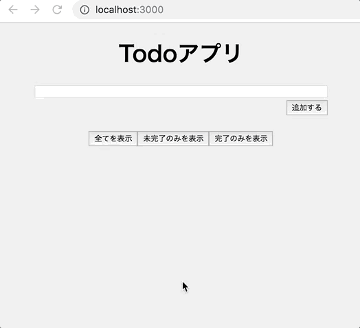

# レポジトリ内容

この課題は、Web白熱教室の「React Redux」の課題その1「[【エクササイズ】React Reduxを使ったTodoアプリを作る](https://tsuyopon.xyz/learning-contents/web-dev/javascript/react/js-exercise-for-react-redux-1/)」の課題レポジトリになります。

## 完成形(イメージ)

## 今回の課題の目的

- 今回の課題では「React Redux」を使いこなせるようになることが目的となる
- ページのデザインは自由
    - 凝ったデザインにしても良いし、全くスタイルがあたってなくても良い
    - あくまでも「React Redux」の理解が最優先事項
        - つまり「コンポーネント」「コンテナー」の役割を理解して実装しているかが重要

## 課題

次に挙げる機能は必ず実装すること

- [ ] Todo1件を追加する機能
- [ ] Todo1件の完了・未完了フラグを切り替える機能
- [ ] Todo1件を削除する機能
- [ ] 以下のフィルタリング機能
    - [ ] 全てのTodoを表示するフィルタリング機能
    - [ ] 未完了のTodoのみを表示するフィルタリング機能
    - [ ] 完了済みのTodoのみを表示するフィルタリング機能

`answerブランチ` に上に貼った「完成形(イメージ)」のサンプルコード(解答コード)を用意しているが、あくまでもサンプルコードという立ち位置で、サンプルコードと全く同じ構成・実装である必要は無い

### 実装のヒント

- 「[React Reduxを学習するための事前準備をする【救済措置あり】](https://tsuyopon.xyz/learning-contents/web-dev/javascript/react/setup-react-redux-env/)」のコードを元に実装を始めても良い

## 実装→レビュー依頼の流れ

1. [Git Flow](https://qiita.com/KosukeSone/items/514dd24828b485c69a05) で開発をすすめること
1. コードレビュー依頼はfeatureブランチ単位で提出すること

上記の流れで開発を進めることで、実装を開始する前にどんなタスクが必要かを洗い出すことになるため、設計力も鍛えられる。
(「タスクを洗い出す→実装戦略をたてる→実装を進める→レビュー依頼を出す」の流れ)

## 参考記事

課題をこなしていて、行き詰まったら以下の資料を参考にしていただければ解答にたどり着けるかと思います。

- Web白熱教室
    - Redux関連
        - [Reduxとは【ReactとReduxの役割の比較】](https://tsuyopon.xyz/learning-contents/web-dev/javascript/react/what-is-the-redux/)
        - [ReduxとReactのデータの流れを図を使って理解する](https://tsuyopon.xyz/learning-contents/web-dev/javascript/react/understand-data-flow-of-redux-and-react/)
        - [【Redux】Actionsとは](https://tsuyopon.xyz/learning-contents/web-dev/javascript/react/what-is-the-actions-in-redux/)
        - [【Redux】Actionsのテストの書き方を覚える](https://tsuyopon.xyz/learning-contents/web-dev/javascript/react/how-to-write-tests-for-actioins-in-redux/)
        - [【Redux】Reducersとは](https://tsuyopon.xyz/learning-contents/web-dev/javascript/react/what-is-the-reducers-in-redux/)
        - [【Redux】Reducersのテストの書き方を覚える](https://tsuyopon.xyz/learning-contents/web-dev/javascript/react/how-to-write-tests-for-reducers-in-redux/)
        - [【Redux】Storeとは(ActionとReducerの連携含む)](https://tsuyopon.xyz/learning-contents/web-dev/javascript/react/what-is-the-store-in-redux/)
        - [【Redux】Storeのテストの書き方を覚える](https://tsuyopon.xyz/learning-contents/web-dev/javascript/react/how-to-write-tests-for-store-in-redux/)
    - React Redux関連
        - [React Reduxとは【図解付き】](https://tsuyopon.xyz/learning-contents/web-dev/javascript/react/what-is-the-react-redux/)
        - [React Reduxを学習するための事前準備をする【救済措置あり】](https://tsuyopon.xyz/learning-contents/web-dev/javascript/react/setup-react-redux-env/)
        - [【React Redux】コンポーネントとコンテナーの役割の違いを比較する](https://tsuyopon.xyz/learning-contents/web-dev/javascript/react/compare-presentational-and-container-components/)
        - [【React Redux】コンテナーの作り方](https://tsuyopon.xyz/learning-contents/web-dev/javascript/react/how-to-create-container-components/)
        - [【React Redux】ProviderでコンテナーにStoreを渡す](https://tsuyopon.xyz/learning-contents/web-dev/javascript/react/use-provider-in-react-redux/)
        - [Redux DevToolsでReduxの動きをブラウザで確認する](https://tsuyopon.xyz/learning-contents/web-dev/javascript/react/how-to-use-redux-devtools/)
- 公式ドキュメント
    - [Redux](https://redux.js.org/)
    - [React Redux](https://react-redux.js.org/)